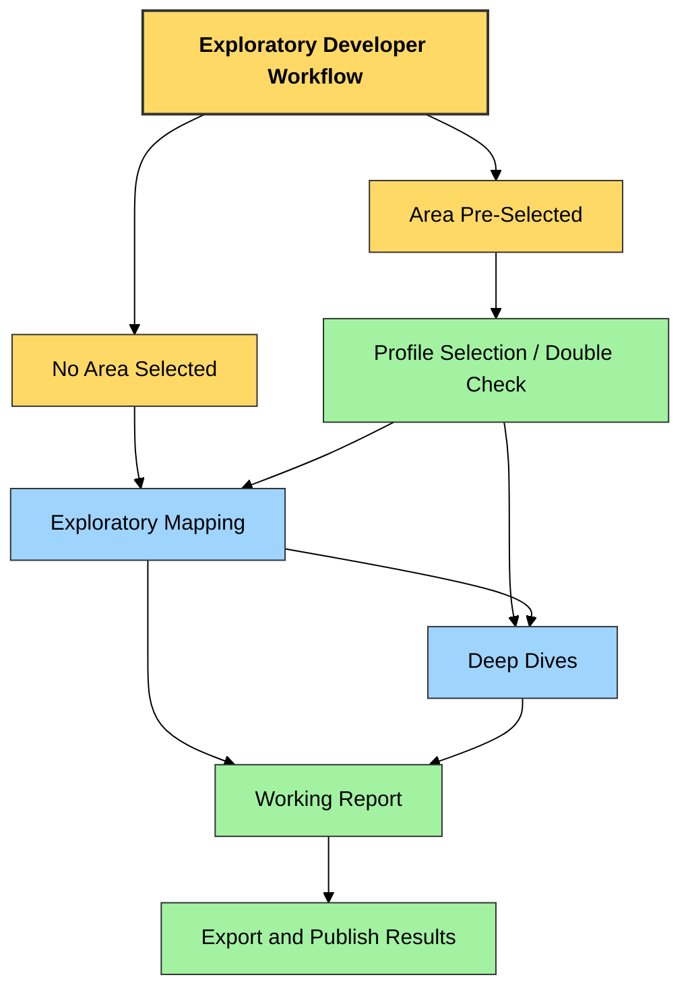

```mermaid
%%{init: {'theme':'forest'}}%%

flowchart TD
%% Classes
classDef title fill:#ffd966,stroke:#333,stroke-width:2px,font-weight:bold;
classDef start fill:#ffd966,stroke:#333,stroke-width:1px;
classDef activity fill:#9fd4ff,stroke:#333,stroke-width:1px;
classDef management fill:#a2f2a2,stroke:#333,stroke-width:1px;

    %% Start nodes
    Title[Exploratory Developer Workflow]:::title
    Start1[No Area Selected]:::start
    Start2[Area Pre-Selected]:::start

    %% Activities
    Mapping[Exploratory Mapping]:::activity
    Dive[Deep Dives]:::activity

    %% Management / output
    Report[Working Report]:::management
    Publish[Export and Publish Results]:::management
    Profile[Profile Selection / Double Check]:::management


    %% Flow
    Title --> Start1
    Title --> Start2
    Start1 --> Mapping
    Start2 --> Profile

    Profile --> Mapping
    Profile --> Dive

    Mapping --> Dive
    Mapping --> Report

    Dive --> Report

    Report --> Publish
```
