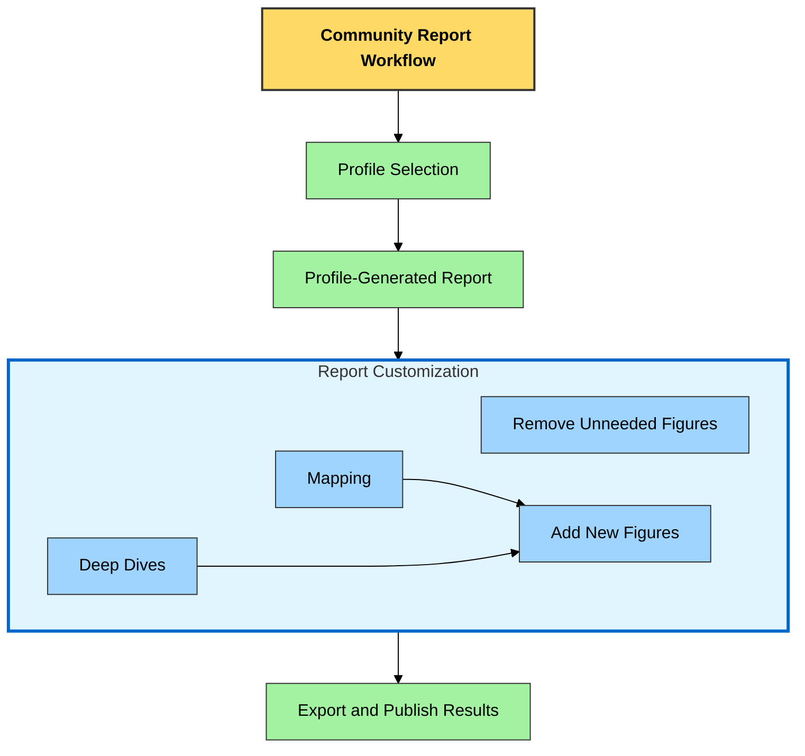

```mermaid

%%{init: {'theme':'forest'}}%%


flowchart TD
	%% Classes
	classDef title fill:#ffd966,stroke:#333,stroke-width:2px,font-weight:bold;
	classDef activity fill:#9fd4ff,stroke:#333,stroke-width:1px;
	classDef management fill:#a2f2a2,stroke:#333,stroke-width:1px;
	classDef subgraphStyle fill:#e1f5ff,stroke:#0066cc,stroke-width:3px


    %% Start / title
    Title[Community Report Workflow]:::title

    %% Activities
    Report[Profile-Generated Report]:::management
    Profile[Profile Selection]:::management
    Publish[Export and Publish Results]:::management

    subgraph Customization[Report Customization]
        Remove[Remove Unneeded Figures]:::activity
        Add[Add New Figures]:::activity
        Mapping[Mapping]:::activity
        Dive[Deep Dives]:::activity

        Mapping --> Add
        Dive ---> Add
    end

    %% Flow
    Title --> Profile
    Profile --> Report
    Report --> Customization
    Customization --> Publish


    %% subgraph styling declarations
	class Customization subgraphStyle
```
