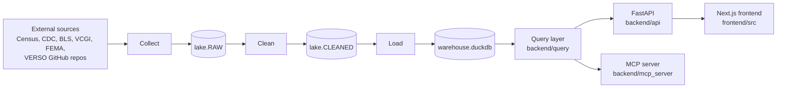

# Codebase Primer

A tour of the Vermont Data Exploration App for someone new to the repository:
why it exists, how the pieces fit, where things live, and how we work with git
and GitHub. It reflects `main` as of 2026-09-28. Commands and setup live in the
[README](../README.md); this page explains the shape of the system behind them.

## Why this exists

Vermont's housing, demographic, zoning, flood, and soil data is spread across
Census APIs, state GIS portals, federal agencies, and regional planning
commissions, each in a different format. The app puts it in one place so
non-technical users (Regional Planning Commissions, Select Boards, developers,
reporters) can filter, compare, map, and export it without writing code.

The design goals that shape the code:

- **Separate the stages.** Collecting, cleaning, querying, and serving are
  different jobs in different folders, so each can be tested and re-run alone.
- **Reproducible data.** The data is rebuilt from its sources by code. The built
  database is not committed to git; the logic is.
- **Cross-dataset filtering.** A zoning district, a flood zone, a soil type, and
  a population count should be filterable together even though they come from
  unrelated sources.
- **Agent-ready.** The same query layer backs the website and an MCP server, so
  LLM agents get the same vetted data access as the UI.

## How it fits together



The top row runs offline as the **ETL pipeline**, whenever data needs
refreshing. The bottom row runs continuously as the **web app**, and only ever
reads `warehouse.duckdb`.

| Stage   | What happens                                                                                     | Entry point                                              |
| ------- | ------------------------------------------------------------------------------------------------ | -------------------------------------------------------- |
| Collect | Scrapers fetch source data and write it, minimally changed, to `lake.RAW`.                       | `just get-data {start} {end}` → `run_data_collection.py` |
| Clean   | Each cleaner reshapes one or more RAW tables into analysis-ready tables in `lake.CLEANED`.       | `just transform-data` → `run_data_cleaning.py`           |
| Load    | Every CLEANED table is copied into `warehouse.duckdb`, plus a `warehouse.schema.json` snapshot.  | `just load-data` → `run_data_loading.py`                 |
| Query   | Python functions and Jinja SQL templates turn filter requests into DuckDB queries.               | `backend/query/`                                         |
| Serve   | FastAPI routes validate requests and call the query layer; the MCP server exposes the same data. | `backend/api/main.py`, `backend/mcp_server/`             |
| Render  | Next.js pages fetch from `/api` and draw charts, tables, and maps.                               | `frontend/src/app/`                                      |

`just run-etl {start_year} {end_year}` runs collect → clean → load in order.

The "lake" is a [DuckLake](https://ducklake.select/): a DuckDB catalog with
Parquet files beside it (`lake` and `lake.files/` under `DATA_DIR`). `RAW` holds
what the source gave us; `CLEANED` holds what the app uses. Raw tables are
documented column by column in [`datasets/`](datasets/).

## Repository map

```text
.
├── backend/                 Python 3.13, managed with uv
│   ├── data_collection/     raw data scrapers: one module per source, write to lake.RAW
│   ├── data_cleaning/       raw data cleaners: RAW → CLEANED; sql/ holds their SQL
│   ├── query/               run-time query logic; sql/ holds Jinja SQL templates
│   │   ├── sql_render.py    Jinja rendering + the filter compiler ($N params)
│   │   └── production_db.py lazy DuckDB connection
│   ├── api/                 FastAPI app: routes/, models/, schema.json (filter tree)
│   ├── data_tools/          shared, bounded data operations (used by MCP)
│   ├── mcp_server/          MCP server (Streamable HTTP, bearer-token auth)
│   ├── ETL/                 dockerfiles for the lake, collect, clean, load steps
│   ├── notebooks/           .qmd walkthroughs of data decisions
│   ├── tests/               pytest suite (golden/ holds expected CSVs)
│   ├── lake_build.py        creates/attaches the DuckLake; insert/replace helpers
│   └── run_data_*.py        the three ETL orchestrators
├── frontend/                Next.js (App Router), React 19, Mantine, Tailwind
│   ├── src/app/             pages: data-viewer, data-comparison, mapping,
│   │                        working-report, data-export, resources, about
│   ├── src/components/      Charts, FilterRedux/FilterUI, mapping, Reports,
│   │                        ItemsProvider (Zustand store for saved charts)
│   ├── src/types/           shared TypeScript types
│   └── nginx.conf           serves the static export and proxies /api
├── docs/                    you are here; see the index in README.md
├── justfile                 every dev, container, ETL, and lint command
├── Procfile                 `just local-dev` runs API + frontend together
└── .github/workflows/       CI: format check, MCP tests, Pages deploy
```

Design notes to know about:

- **Routes stay thin.** Business logic belongs in `backend/query/`; routes
  validate input and format output.
- **Filtering is schema-driven.** [`backend/api/schema.json`](../backend/api/schema.json)
  defines which columns can be filtered and how datasets join. See
  [architecture/etl.md](architecture/etl.md#schema) and
  [architecture/filtering.md](architecture/filtering.md).
- **SQL is templated.** Templates under `query/sql/` and `data_cleaning/sql/` are
  Jinja, linted with sqlfluff. The filter compiler emits `$N` placeholders and a
  params list; execute with `DB.execute(sql, params)`, never string-format
  values into SQL.
- **The frontend talks to the API through one base URL**, set by
  `NEXT_PUBLIC_API_URL` locally and same-origin `/api` in containers.

## Common tasks

Run everything from the repository root; `just --list` shows all our defined recipes.

| I want to…                     | Run                                                                    |
| ------------------------------ | ---------------------------------------------------------------------- |
| Run the app with hot reload locally    | `just local-dev` (API on :6767, site on :3000)                         |
| Run the production-like stack  | `just dev` (podman pod, nginx, same-origin `/api`)                     |
| Rebuild all data               | `just run-etl 2009 2024` (needs `CENSUS_API_KEY`; about 20–30 minutes) |
| Re-run one collector           | `just get-data 2020 2024 zoning`                                       |
| Re-run one cleaner             | `just transform-data clean_zoning`                                     |
| Lint everything                | `just lint`                                                            |
| Format                         | `just format` (frontend + SQL); `ruff format` for Python               |
| Run backend tests              | `just test`                                                            |
| Run MCP tests (no data needed) | `just test-mcp`                                                        |
| Run the MCP server locally     | `just mcp` → `http://127.0.0.1:6768/api/mcp`                           |

### Add a new dataset

1. **Collect.** Add `backend/data_collection/<source>.py` with a `collect()`
   that returns a DataFrame, or a dict of `{table_name: DataFrame}`. Register the
   module in `YEARLY_SCRAPERS` (needs a `year` column; `collect(years)`) or
   `STATIC_SCRAPERS` (replaced wholesale each run) in `run_data_collection.py`.
2. **Clean.** Add `backend/data_cleaning/clean_<source>.py` with a
   `main(con)` that writes `lake.CLEANED.<table>`. The orchestrator discovers it
   automatically.
3. **Query and serve.** Add a function and SQL template under `backend/query/`,
   a route under `backend/api/routes/`, and (if it should be filterable) an entry
   in `schema.json`. Expose it to agents through `data_tools/` if appropriate.
4. **Document.** Add `docs/datasets/<raw_table>.md`, copying
   [`datasets/zoning.md`](datasets/zoning.md).
5. **Test.** Add a pytest under `backend/tests/`, and a golden CSV if the output
   is a published number.

## Git and GitHub workflow

- **`main` is the deployable branch.** Never commit to it directly.
- **Commit small**:
- **Open a pull request into `main`.** We merge with merge commits, so history
  reads `Merge pull request #140 from …`. Keep your branch current by merging
  `origin/main` into it before making a PR.
- **Pre-commit hooks** run `ruff format` on Python and `npx prettier --write .` on
  frontend TypeScript. Install once with `pre-commit install`. A Claude Code hook
  (`.claude/hooks/format.py`) also formats files it edits.
- **Large files.** CDC CSVs and `*.duckdb` are tracked with Git Large File Storage (LFS)
  (`git lfs install` before cloning). The DuckLake catalog and `lake.files/` are
  gitignored; build them with the ETL process `just run-etl` recipe (this one takes a while).
- **Secrets** go in `.env` (gitignored). Add just the new variable names to
  `.env.example` with a description.
- The repository lives at `VERSO-UVM/react-vt-data` on GitHub. Older clones may
  still have `origin` pointing at `FWJK1/react-vt-data`; check `git remote -v` to verify.

### Continuous Integration

| Workflow                                        | Runs on                            | Checks                                                         |
| ----------------------------------------------- | ---------------------------------- | -------------------------------------------------------------- |
| [Format Check](../.github/workflows/format.yml) | every PR, push to `main`           | `prettier --check` (frontend), `ruff format --check` (backend) |
| [MCP tests](../.github/workflows/mcp.yml)       | PRs and pushes touching `backend/` | MCP lint, format, and fixture-based tests                      |
| [Deploy](../.github/workflows/deploy.yml)       | push to `main`                     | builds the static frontend and publishes it to GitHub Pages    |

Run `just lint` and `just test` before pushing; CI runs the same checks.

## Deployment

The API, frontend, and ETL run as rootless **podman** containers on a UVM
virtual machine. The API mounts the data directory read-only; the ETL mounts it
read-write. The frontend is a static Next.js export served by nginx, which also
proxies `/api/` to the API so the browser sees one origin.

To ship: 
1. SSH to the VM using `ssh <netid>@vtdatacollab.uvm.edu`
2. Switch to `appuser0` using `sudo su - appuser0`.
3. Ensure the current directory is "react-vt-data" using `cd react-vt-data` and `pwd`.
4. Pull the new changes on the main branch using `git pull`.
5. If data collection, cleaning, or loading code changed (ETL), run `just run-etl 2009 2024`. If these files have no changes, you can skip this step. If there is a DB connection issue for `warehouse.duckdb`, run `just down`, and rerun `just load-data`.
5. Run `just dev` to restart the app containers. 

The step-by-step version is in the
[README](../README.md#virtual-machine-vm-deployment); the verification checklist
is in [architecture/containers.md](architecture/containers.md), and MCP rollout
is in [guides/mcp.md](guides/mcp.md#deployment-in-this-repository).

## Gotchas

-
- **Ports 3000 and 6767 are shared** by the local and container workflows. Only
  one can run at a time; `just down` stops the pod.
- **Known open data issues** are tracked in
  [reports/2026-09-16-data-issues.md](reports/2026-09-16-data-issues.md).

## Where to read next

| If you want to…                    | Read                                                     |
| ---------------------------------- | -------------------------------------------------------- |
| Understand the pipeline in depth   | [architecture/etl.md](architecture/etl.md)               |
| Understand containers and rollout  | [architecture/containers.md](architecture/containers.md) |
| Understand filter object design    | [architecture/filtering.md](architecture/filtering.md)   |
| Look up a raw table's columns      | [datasets/](datasets/)                                   |
| Use or deploy the MCP server       | [guides/mcp.md](guides/mcp.md)                           |
| See past decisions and old designs | [archive/](archive/)                                     |
